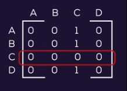

# The Celebrity Problem

```
Ref: https://www.geeksforgeeks.org/the-celebrity-problemT
Tags: Matrix, Stack, Graph, Recursion
Company: Amazon, Google, Microsoft, United Health Group …
```
 
* In a party of N people, only one person is known to everyone. Such a person may be present in the party. if yes, (s)he doesn’t know anyone in the party. 
We can only ask questions like “does A know B? “. Find the stranger (celebrity) in minimum number of questions.
 
* We can describe the problem input as an array of numbers/characters representing persons in the party.
We also have a hypothetical function Knows(A, B) which returns true if A knows B, false otherwise. How can we solve the problem.
 
* Suppose there are 4 people (A,B,C,D) in a party you will be given a boolean matrix:
* Here "1" means that a person in row knows the person in the column. Like A knows C in the first row.
* For simplicity in the algorithm we have assumed that a person does not know himself.



* By looking at the matrix you can say that "C" is the celebrity.
As "C" does not know anyone but everyone knows "C".
 
* A native solution could be that we scan all the elements of this matrix and search for a row which contains all "zeros".
The complexity will be O(N^2)
 
* This following observations can be made in this problem
If A knows B, then A can't be celebrity. Discard A, and B may be celebrity.
If A doesn't know B, then B can't be celebrity. Discard B, and A may be celebrity.
We can use these to reduce our comparisons..

