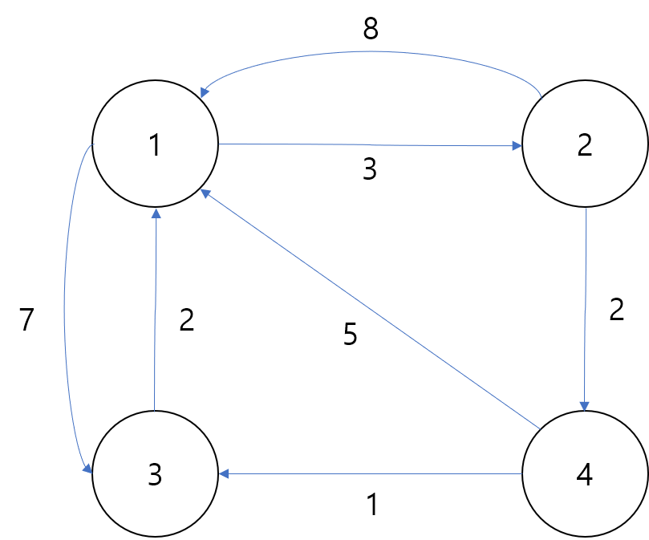

# Evaluate Division
* Equations are given in the format A / B = k, where A and B are variables represented as strings, and k is a real number (floating point number). Given some queries, return the answers. If the answer does not exist, return -1.0.

```
Example:
Given a / b = 2.0, b / c = 3.0.
queries are: a / c = ?, b / a = ?, a / e = ?, a / a = ?, x / x = ? .
return [6.0, 0.5, -1.0, 1.0, -1.0 ].

The input is: vector<pair<string, string>> equations, vector<double>& values, vector<pair<string, string>> queries , where equations.size() == values.size(), and the values are positive. This represents the equations. Return vector<double>.

According to the example above:

equations = [ ["a", "b"], ["b", "c"] ],
values = [2.0, 3.0],
queries = [ ["a", "c"], ["b", "a"], ["a", "e"], ["a", "a"], ["x", "x"] ].
```

* The input is always valid. You may assume that evaluating the queries will result in no division by zero and there is no contradiction.

## 솔루션
* 두가지 방법으로 풀 수 있다
    * 플로이드-워셜 알고리즘(Floyd-Warshall Algorithm)
    * 일반적인 DFS 방식

### 플로이드 워셜 알고리즘
* 플로이드-워셜 알고리즘은 그래프에서 최단 경로를 구하는 알고리즘 중 하나이다.
    * 다익스트라와 벨만-포드 알고리즘은 한 정점에서 다른 모든 정점 사이의 최단 경로를 구하는 것과 달리, 플로이드-워셜 알고리즘은 모든 정점 사이의 최단 경로를 구한다.
    * https://sjnov11.github.io/blog/algorithm/2018/08/24/floyd-warshall.html
    * 아래 설명은 위의 블로그 요약한 것임
    * 최단경로를 Dynamic Programming 형태의 문제로 정의
        * 1에서 까지 번호가 매겨진 정점들을 갖는 그래프에서 집합의 정점들만을 경유지로 거치는 최단경로를 반환하는 함수를 생각한다.
        * 각각의 정점 쌍에 대해서, 아래의 경우에 최단거리가 있다
        * 
        * 무식하게 모든 거리들을 DP로 정의하고 모든 경우의 수를 구해서 값을 구한것이다

        ```py
        graph = {a:{b:1,c:2,...}, b:{a:2,c:3,...}, c:{...}, ....}
        ...
        for s in graph:
            for v1 in graph[s]:
                for v2 in graph[s]:
                     graph[v1][v2] = graph[v1][s] * graph[s][v2]
        ```

### 소스코드

```py
class Solution:
    def calcEquation(self, equations: List[List[str]], values: List[float], queries: List[List[str]]) -> List[float]:
        graph = defaultdict(lambda:{})

        for v, cost in zip(equations, values):
            graph[v[0]][v[0]], graph[v[1]][v[1]]=1,1
            graph[v[0]][v[1]], graph[v[1]][v[0]]=cost,1/cost

        for s in graph:
            for v1 in graph[s]:
                for v2 in graph[s]:
                     graph[v1][v2] = graph[v1][s] * graph[s][v2]

        return [graph[vex[0]].get(vex[1], -1.0) for vex in queries]
```

### DFS 방식
* 그래프를 구성하고 그래프를 따라가면서 목표로 했던 값이 나오면 그동안의 cost를 곱해서 돌려준다
```py
CAN_NOT_FIND_PATH = -1.0

class Solution:
    def calcEquation(self, equations, values, queries):
        self.graph = defaultdict(lambda: {})
        self.visited = defaultdict(lambda: 0)

        for vex, cost in zip(equations, values):
            self.graph[vex[0]][vex[1]], self.graph[vex[1]][vex[0]] = cost, 1/cost
            self.graph[vex[0]][vex[0]], self.graph[vex[1]][vex[1]] = 1.0,1.0

        def calcPaths(s, e, current):
            # calcPaths
            # s -> neighbors -> neighbors of neighbors
            print("s:{}, e:{}, current:{}".format(s,e,current))
            if s in self.graph and e in self.graph[s]:
                return current*self.graph[s][e]

            if self.visited[s] != 0:
                return CAN_NOT_FIND_PATH

            neighbors = self.graph[s]
            for k, v in neighbors.items():
                if k == e:
                    return current*v
                self.visited[s]=1
                val = calcPaths(k, e, current*v)
                self.visited[s]=0
                if val != -1:
                    return val

            return CAN_NOT_FIND_PATH # not found

        return [calcPaths(pt[0], pt[1], 1) for pt in queries]
```

